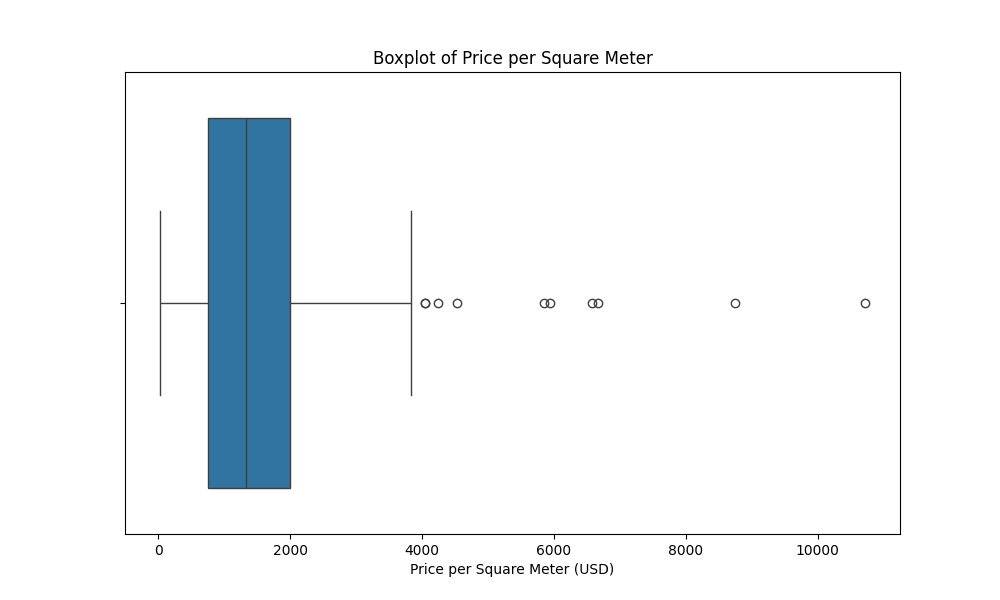

# **Real Estate Analysis in El Salvador: Comprehensive Report**

**Author:** Manuel Ventura

#### Introduction

The real estate market in El Salvador is a dynamic and complex sector that requires comprehensive analysis to uncover underlying trends and provide valuable insights. This project aims to analyze a dataset of properties in El Salvador, focusing on exploratory data analysis, predictive modeling, and visualization. By leveraging various data science techniques, we aim to predict property prices and identify key factors influencing the real estate market.

---

## Theoretical Framework

### Data Science in Real Estate

Data science plays a pivotal role in the real estate industry by enabling data-driven decision-making. Key components of data science in real estate include:

1. **Data Collection**: Gathering data from various sources, such as web scraping, APIs, and public records.
2. **Data Cleaning**: Ensuring data quality by handling missing values, correcting errors, and standardizing formats.
3. **Exploratory Data Analysis (EDA)**: Understanding data distribution, relationships, and patterns through statistical analysis and visualization.
4. **Predictive Modeling**: Building models to predict future outcomes, such as property prices, using historical data.
5. **Visualization**: Creating visual representations of data to communicate insights effectively.

### Machine Learning in Real Estate

Machine learning models are used to predict property prices, identify market trends, and optimize investment strategies. Commonly used models in real estate include:

1. **Linear Regression**: A simple model that predicts a target variable based on linear relationships between features.
2. **Decision Trees**: A non-linear model that splits data into subsets based on feature values to make predictions.
3. **Random Forests**: An ensemble model that combines multiple decision trees to improve accuracy and robustness.
4. **Hyperparameter Tuning**: Optimizing model parameters to enhance performance.

---

## Data Exploration

### Overview of the Data

The dataset used in this analysis comprises various attributes of properties listed for sale in El Salvador. The main columns include:

- **Price**: The listed price of the property.
- **Square Meters**: The size of the property in square meters.
- **Bedrooms**: The number of bedrooms in the property.
- **Bathrooms**: The number of bathrooms in the property.
- **Parking**: The number of parking spaces available.
- **Location**: The geographic location of the property.
- **Latitude and Longitude**: Geographic coordinates for mapping.
- **Cluster**: Clustering labels for properties based on their features.

### Summary Statistics

Below are the summary statistics of the dataset, providing an overview of the data distribution:

| Metric             | Count | Mean      | Std Dev   | Min         | 25%        | 50%        | 75%       | Max        |
| ------------------ | ----- | --------- | --------- | ----------- | ---------- | ---------- | --------- | ---------- |
| **Price**          | 980   | 374913.44 | 342244.45 | 110000.00   | 150000.00  | 279000.00  | 450000.00 | 1980000.00 |
| **Square Meters**  | 980   | 238.53    | 228.28    | 102.67      | 126.00     | 206.00     | 300.00    | 1350.00    |
| **Bedrooms**       | 980   | 3.32      | 1.47      | 0.00        | 3.00       | 3.00       | 4.00      | 8.00       |
| **Parking**        | 980   | 2.88      | 1.85      | 1.00        | 2.00       | 2.00       | 3.00      | 12.00      |
| **Bathroom**       | 980   | 2.71      | 1.41      | 1.00        | 2.00       | 2.00       | 3.00      | 6.00       |
| **Cluster**        | 980   | 0.31      | 0.54      | 0.00        | 0.00       | 0.00       | 1.00      | 2.00       |
| **Latitude**       | 980   | 13.72     | 0.13      | 13.52       | 13.67      | 13.69      | 13.71     | 14.00      |
| **Longitude**      | 980   | -89.24    | 0.27      | -89.89      | -89.29     | -89.22     | -89.21    | -88.75     |
| **Location Num**   | 980   | 4.65      | 2.76      | 0.00        | 3.00       | 4.00       | 7.00      | 33.00      |
| **Lin Reg Pred**   | 980   | 386882.76 | 225249.84 | -1365657.06 | 12794.56   | 31503.81   | 501095.26 | 1206232.00 |
| **Tree Pred**      | 980   | 370211.56 | 397904.84 | 110000.00   | 150000.00  | 278518.89  | 450000.00 | 1850000.00 |
| **Forest Pred**    | 980   | 374477.56 | 300524.83 | 88818.86    | 174295.00  | 282518.00  | 470117.50 | 1630632.06 |
| **Tuned RF Pred**  | 980   | 370225.29 | 280784.83 | 120925.00   | 176563.00  | 283174.00  | 464943.50 | 1481565.06 |
| **Lin Reg Resid**  | 980   | 3206.15   | 213824.78 | -757249.06  | -94926.56  | -130974.89 | 614462.49 | 1452872.00 |
| **Tree Resid**     | 980   | 39922.26  | 121243.52 | -1068257.86 | 0.00       | 0.00       | 0.00      | 1410000.00 |
| **Forest Resid**   | 980   | -56418.85 | 190345.15 | -939202.05  | -365758.56 | -448791.93 | 187583.33 | 1020787.06 |
| **Tuned RF Resid** | 980   | 39681.15  | 138573.64 | -382859.15  | -47054.11  | -73487.11  | 29835.32  | 1057856.00 |

### Visualizations

#### Average Price by Location

This bar chart shows the average property price in different locations across El Salvador, highlighting areas with higher average prices, indicating higher demand and possibly better infrastructure.

#### Boxplot of Price per Square Meter

The boxplot illustrates the distribution of property prices per square meter. This helps in understanding the price variation across different properties.

#### Cross-Validation MSE Distribution

This plot shows the distribution of Mean Squared Error (MSE) across different cross-validation folds, providing insight into the model's performance variability.

#### Distribution of Square Meters by Location

This bar chart displays the distribution of property sizes in square meters across different locations. It highlights the size variation of properties in urban versus rural areas.

#### Feature Importance from Random Forest

The bar chart shows the importance of different features in predicting property prices, as determined by the Random Forest model. This helps identify which features have the most influence on the model's predictions.

#### Histogram of Price per Square Meter

This histogram displays the frequency distribution of property prices per square meter, providing an overview of price ranges and identifying common price points.

#### Histograms of Residuals

The histograms show the distribution of residuals (the difference between actual and predicted prices) for the various models. This helps in understanding the prediction errors of each model.

---

## Predictive Modeling

### Model Building

We employed several machine learning models to predict property prices, including:

1. **Linear Regression**: A baseline model that assumes a linear relationship between features and the target variable.
2. **Decision Tree**: A model that splits the data into subsets based on feature values to make predictions.
3. **Random Forest**: An ensemble method that combines multiple decision trees to improve accuracy and robustness.
4. **Tuned Random Forest**: A Random Forest model with optimized hyperparameters to enhance performance.

### Model Performance

The performance of each model was evaluated using Mean Squared Error (MSE) and R-squared (R²) metrics. The results are summarized below:

| Model               | MSE                | R²                 |
| ------------------- | ------------------ | ------------------ |
| Linear Regression   | 476451420.010747   | 0.5928151204195274 |
| Decision Tree       | 1745996062.4757835 | 0.8507845435038352 |
| Random Forest       | 12051550204.153212 | 0.8970056345574438 |
| Tuned Random Forest | 1919093419.381012  | 0.8359216523736016 |

### Residuals Analysis

Analyzing the residuals helps

in understanding the errors made by the models. Below is the residuals plot for the Tuned Random Forest model, which shows the difference between actual and predicted prices.

#### Scatter Plot of Predictions vs. Actual Values

This plot compares the actual property prices with the predictions made by the models, providing a visual representation of model accuracy.

---

## Geospatial Analysis

### Property Heat Map

A heat map was created to visualize the density of properties in different regions of El Salvador. This map helps in identifying areas with higher concentrations of property listings.

---

## Insights and Conclusions

### Key Insights

1. **Price Distribution**: The average price of properties varies significantly across different locations, with urban areas like San Salvador showing higher average prices.
2. **Feature Importance**: The Random Forest model identified key features influencing property prices, such as square meters, location, and the number of bedrooms.
3. **Model Performance**: The Tuned Random Forest model provided the best performance in terms of accuracy, followed by the Random Forest and Decision Tree models.
4. **Geospatial Trends**: The heat map revealed high concentrations of property listings in urban areas, indicating higher market activity in these regions.

### Conclusion

This analysis provides a comprehensive overview of the real estate market in El Salvador. By leveraging data science and machine learning techniques, we were able to uncover key insights and build predictive models to estimate property prices. The findings can help stakeholders make informed decisions and optimize their strategies in the real estate market.

### Future Work

1. **Data Expansion**: Collect more data to improve model robustness and accuracy.
2. **Advanced Models**: Explore other advanced machine learning techniques to enhance predictive performance.
3. **Interactive Dashboard**: Develop an interactive dashboard for real-time data analysis and visualization.

---

This report aims to offer a detailed analysis of the real estate market in El Salvador, utilizing various data science techniques to derive meaningful insights and accurate predictions. The visualizations and models presented provide a comprehensive understanding of the market dynamics, aiding in better decision-making for stakeholders.
